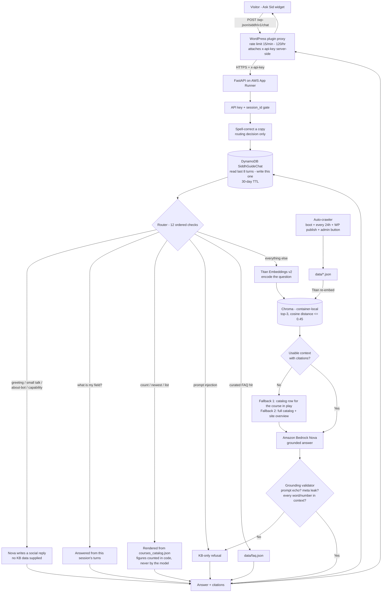

# Ask Sid Chatbot

FastAPI + Chroma RAG chatbot for Siddhanta Knowledge, grounded strictly on the
foundation's own websites (KB-only, no general-knowledge answers).

> **WordPress side — plugin install, API key, shortcode, troubleshooting:**
> see **[WORDPRESS-RUNBOOK.md](WORDPRESS-RUNBOOK.md)**.
> This README covers the backend, crawler and AWS deployment.

## Architecture



Other routes: `GET /health` (KB counts + `auto_crawl`), `GET /history/{session_id}`,
`POST /admin/refresh`. There is **no answer cache** — an earlier one was removed
because cached entries carried no retrieval context or citations, so they could
not be re-validated against the knowledge base after a crawl.

## Live auto-crawler (keeps the knowledge base fresh)

The bot's knowledge comes from `backend/data/*.json`, which are regenerated from
the **live** websites by `backend/crawler.py` and re-embedded into Chroma by
`backend/refresh.py`.

**What it crawls** (via WordPress sitemaps + REST):
- Every enrollable Siksha course (WooCommerce `product` type — **32** in the
  committed snapshot, excluding the non-course "EIE Quiz" and "Gift Coupon").
  Drives the dynamic course count/list, so the live number is whatever the last
  crawl found — check `GET /health` (`courses_live`) rather than this line.
- All key pages: home, about, Siksha, Aajivan, Sandhaan (+ linguistics / jyotisha
  / yoga / kosha / shastra-maps), Shodha (+ siddhanta-prastuti / indic-thought-models
  / conscious-enterprise-management), Prakashan, Events, Contact, all policies.
- `siddhantavijnan.org` and the latest blog posts.

**Automatic — no manual steps.** `AUTO_CRAWL` defaults to **on**. On each deploy
the app crawls once in the background shortly after startup, then re-crawls every
`CRAWL_INTERVAL_HOURS` (default 24h). Crawling never blocks boot, and any failure
leaves the last-good data + index untouched.

### Configuration (set in the deploy environment — `.env` is not shipped)

| Env var | Default | Purpose |
|---|---|---|
| `AUTO_CRAWL` | `1` (on) | Master switch. **Set to `0` to fully revert** to the static committed JSON snapshot — no code change. |
| `CRAWL_ON_STARTUP` | `1` | Crawl once shortly after boot. |
| `CRAWL_INTERVAL_HOURS` | `24` | Re-crawl cadence; `0` disables the periodic loop. |
| `CRAWL_REBUILD_INDEX` | `1` | Re-embed into Chroma after each crawl (needs Bedrock/Titan access). |
| `CRAWL_ADMIN_KEY` | — | Secret for `POST /admin/refresh` (defaults to `CHAT_API_KEY`). |
| `NOVA_MODEL_ID` | — | **Required.** Bedrock Nova inference-profile ARN. The committed `.env` has a placeholder — set the real value in the deploy env. |
| `BEDROCK_EMBED_MODEL_ID` | `amazon.titan-embed-text-v2:0` | Embedding model. Must be `amazon.titan-embed-*` or `cohere.embed-*`; anything else is refused at boot by name. |
| `EMBED_SELF_CHECK` | `1` | Embed one probe string after boot and report the result on `/health` (`embedding.ok`, `error_type`, `error_hint`). |
| `EMBED_BATCH_SIZE` | `96` | Texts per Bedrock call for Cohere models (Titan takes one per call). |
| `EMBED_CONCURRENCY` | `8` | Parallel Bedrock calls for Titan models during a re-index. |

### Is retrieval actually working?

`GET /health` reports `courses_live` and `website_entries` — those are **crawl**
counts and say nothing about whether the text was embedded. The fields that do:

| Field | Meaning |
|---|---|
| `index_documents` | Vectors actually in Chroma. `0` means every knowledge-base question will be refused. |
| `retrieval_ready` | `true` only when the embedding probe passed **and** the index is non-empty. |
| `embedding.error_type` | The AWS error code from the boot probe, e.g. `AccessDeniedException`, `ValidationException`, `ResourceNotFoundException`, `ThrottlingException`. |
| `embedding.error_hint` | Which fix that code points at: `iam_policy_denies_bedrock_invokemodel_on_this_model`, `bedrock_model_access_not_granted_in_region`, `request_body_does_not_match_model_family`, `model_id_not_available_in_region`, `quota_throttled`, `unknown_model_family`. |

The instance role needs `bedrock:InvokeModel` on the **embedding model's
foundation-model ARN** (`arn:aws:bedrock:ap-south-1::foundation-model/<id>`)
as well as on the Nova inference profile — the two are separate resources.

### Manual refresh (no redeploy)

```bash
# background (returns immediately)
curl -X POST https://<host>/admin/refresh -H "x-api-key: <CHAT_API_KEY>"
# wait for the summary
curl -X POST "https://<host>/admin/refresh?wait=1" -H "x-api-key: <CHAT_API_KEY>"
```

`GET /health` reports `courses_live`, `website_entries`, and `auto_crawl`.

### Run the crawler standalone

```bash
cd backend && python -m crawler   # rewrites data/website.json + data/courses_catalog.json
```

## How to revert the crawler

1. **Fastest / no deploy:** set `AUTO_CRAWL=0` in the environment and restart. The
   app serves the committed static JSON exactly as before.
2. **Full removal:** `git revert` the crawler commit. New files
   (`crawler.py`, `refresh.py`, `data/courses_catalog.json`) and the flag-gated
   hooks in `main.py`/`config.py` are self-contained.

## Deployment (AWS App Runner via ECR)

The backend runs on **AWS App Runner**, which pulls a Docker image from **Amazon
ECR**. Shipping a code change = build the image → push to ECR → App Runner deploys.

**Deploy targets** (account `417311687123`, region `ap-south-1`):

| Setting | Value |
|---|---|
| ECR image | `417311687123.dkr.ecr.ap-south-1.amazonaws.com/siddh-guide-backend:latest` |
| App Runner service | `siddh-guide-chat` |
| Service ARN | `arn:aws:apprunner:ap-south-1:417311687123:service/siddh-guide-chat/cd85f7d386324ef0b5914147f4204ac1` |
| Live URL | `https://nyrqbf2z3k.ap-south-1.awsapprunner.com` |

> **Auto-deploy is ON.** Pushing a new `:latest` to ECR makes App Runner deploy
> automatically — you do **not** need `start-deployment` (it errors while a
> deploy is already in progress). Just push and watch the service reach `RUNNING`.

### Prerequisites (one-time)

- **Docker Desktop** (on Windows: WSL 2 backend — `wsl --install`, then install Docker Desktop).
- **AWS CLI v2**, configured with an IAM user that can push to ECR and read App Runner:
  ```bash
  aws configure          # region: ap-south-1, output: json
  ```
  Credentials live in `~/.aws/credentials` — **never commit them**.

### 1. Test before you build

```bash
cd backend && python -m pytest ../tests -q     # must be green
```

### 2. Build a clean, App-Runner-compatible image

App Runner requires a **single linux/amd64** image. Build with `--provenance=false`
so Docker does **not** produce an attestation/manifest-list that App Runner can
fail to pull:

```bash
docker build --platform linux/amd64 --provenance=false -t siddh-guide-backend:latest .
```

### 3. Push to ECR (PowerShell)

```powershell
$ACCOUNT="417311687123"; $REGION="ap-south-1"; $REPO="siddh-guide-backend"
$ECR="$ACCOUNT.dkr.ecr.$REGION.amazonaws.com"
aws ecr get-login-password --region $REGION | docker login --username AWS --password-stdin $ECR
docker tag siddh-guide-backend:latest "$ECR/$REPO:latest"
docker push "$ECR/$REPO:latest"
```

(bash is identical without the `$var` PowerShell syntax.)

### 4. Watch the auto-deploy reach RUNNING

```bash
SVC="arn:aws:apprunner:ap-south-1:417311687123:service/siddh-guide-chat/cd85f7d386324ef0b5914147f4204ac1"
aws apprunner describe-service --service-arn "$SVC" --region ap-south-1 \
  --query 'Service.Status' --output text          # OPERATION_IN_PROGRESS -> RUNNING
```

If auto-deploy is ever turned **off**, trigger it manually once the service is
`RUNNING`: `aws apprunner start-deployment --service-arn "$SVC" --region ap-south-1`.

### 5. Verify the live bot

```bash
curl -s https://nyrqbf2z3k.ap-south-1.awsapprunner.com/health
# then a couple of KB questions (needs the CHAT_API_KEY):
curl -s -X POST https://nyrqbf2z3k.ap-south-1.awsapprunner.com/chat \
  -H "Content-Type: application/json" -H "x-api-key: <CHAT_API_KEY>" \
  -d '{"message":"Samskrit 1","session_id":"deploy-check"}'
```

### Automated CI/CD (GitHub Actions)

`.github/workflows/deploy.yml` does the manual steps for you: on every push to
`main` that touches `backend/`, `Dockerfile`, or `requirements.txt` (or via the
Actions tab → **Run workflow**), it runs the tests, builds the amd64 image, and
pushes it to ECR. App Runner's **auto-deploy** then redeploys, and the new
container **auto-crawls** the live site on boot — so a normal `git push` ships
code *and* refreshes the knowledge base with no extra steps.

**One-time setup** — add two GitHub repo secrets
(**Settings → Secrets and variables → Actions**):

| Secret | Value |
|---|---|
| `AWS_ACCESS_KEY_ID` | Access key of a CI IAM user |
| `AWS_SECRET_ACCESS_KEY` | Its secret |

Use a **dedicated CI IAM user**, not a personal key. Minimum permissions: ECR
push (`ecr:GetAuthorizationToken`, `ecr:BatchCheckLayerAvailability`,
`ecr:InitiateLayerUpload`, `ecr:UploadLayerPart`, `ecr:CompleteLayerUpload`,
`ecr:PutImage`, `ecr:BatchGetImage`) on the `siddh-guide-backend` repo, plus
`apprunner:DescribeService`. App Runner performs the deploy itself via its own
ECR access role, so CI needs no `apprunner:StartDeployment`.

### Required environment variables (set on the App Runner service)

`NOVA_MODEL_ID` (Bedrock Nova inference-profile ARN) and `CHAT_API_KEY` are
**required**; see the crawler/config table above for the rest. The container also
needs an instance role with **Bedrock** (Titan embeddings + Nova) and **DynamoDB**
(`SiddhGuideChat`) access.

### Rollback

Re-push a previously known-good image, or in the App Runner console pick an earlier
deployment. Because the tag is always `:latest`, keep a dated tag for anything you
may want to roll back to (e.g. `docker tag … $ECR/$REPO:2026-07-22`).
